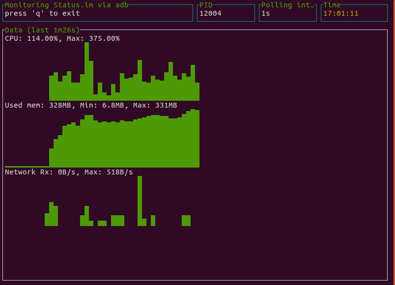

# StatusMonitor

Simple command line app for monitoring CPU of the Status.im application running on the device (or simulator).

---

TODO:

 - iOS support
 - Add more metrics (memory, custom expvars, etc)
 - Optimize for higher frequencies (now 1s resolution)

---

# Installation

Just:

```
go get github.com/divan/statusmonitor
```

# Usage

Just run `statusmonitor` binary. It will automatically connect to your device using `adb`, find the Status.im PID and start collecting data:
```
./statusmonitor
```


Press `q` to exit.

If you want to analyze data after, use `-csv` switch — all data will be written in the CSV file. Name of the file is autogenerated in form `20160102_150405.csv` in the current folder.

# Plot CSV with R
To analyze the data, you may use R lang. Here is a sample code that works well in R Studio:

Load data and convert UNIX timestamps into R's POSIXct object:
```
df = read.csv("~/Downloads/data.csv")
df$timestamp = as.POSIXct(df$timestamp, origin="1970-01-01")
```

Draw the plot:

```
plot(df, type="l", main="status CPU usage", col = 'green', lwd=2, cex.main=1.5, cex.axis=1, xlab="time", xaxt="n")
axis.POSIXct(1, df$timestamp, format="%H:%M:%S")
```


or interactive version with plotly:

```
library(plotly)
plot_ly(df, x = df$timestamp, y = df$cpu, type = 'scatter', mode = 'lines', fill = 'tozeroy')
```

